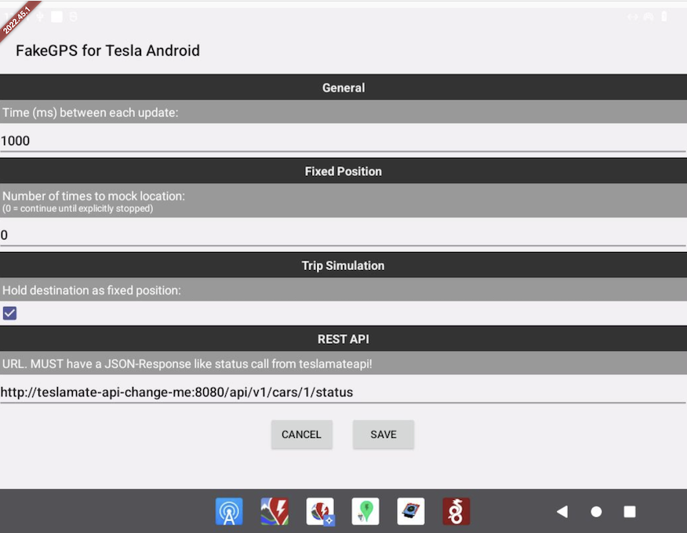
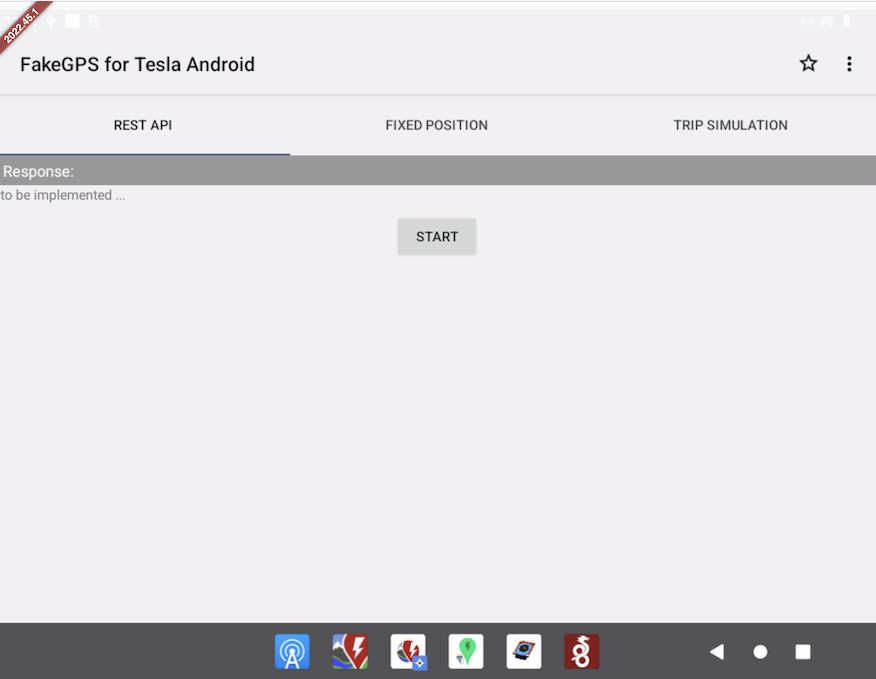
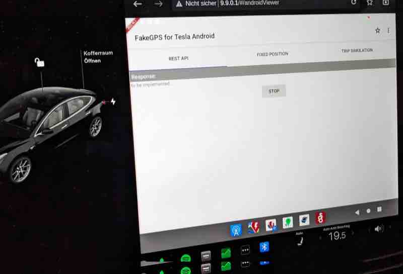
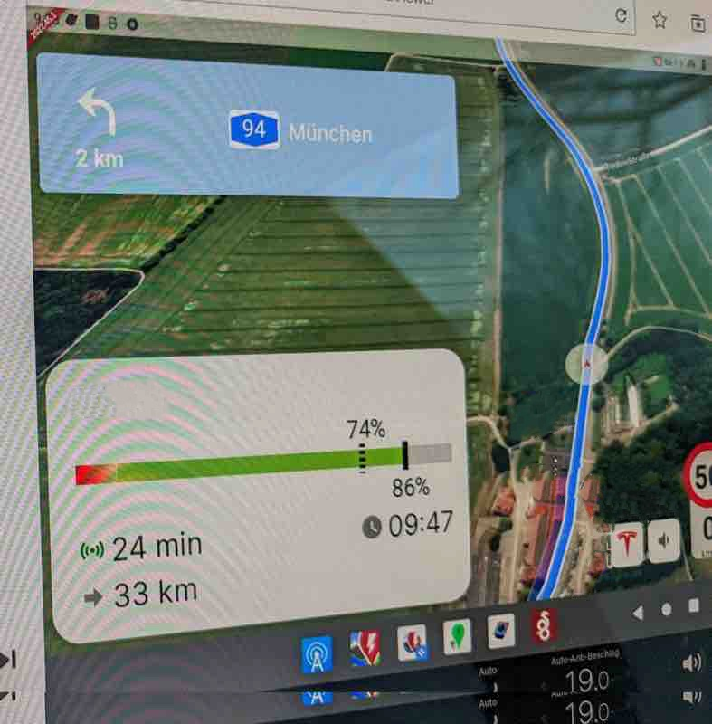
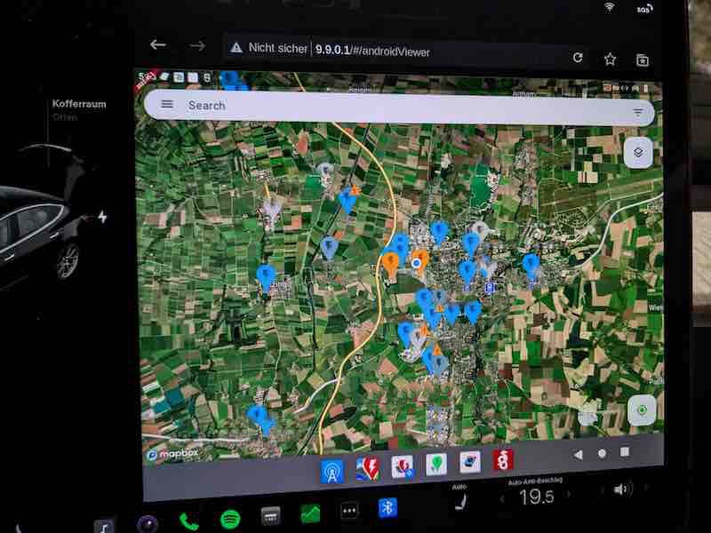

# FakeGPS for [Tesla Android](https://teslaandroid.com/release-notes)

**The changes are curently not pushed. I'm doing some test drives before. Stay tuned.**

updated 2022-12-21 - after a few trips

# a few words before 

Since Android Auto [doesn't working very well](https://github.com/tesla-android/issue-tracker/issues/138), I decided to try pure Tesla Android.
I was missing some apps (described [here](https://github.com/ca-dmin/tesla-android-notes)) and also the apps did not work well without locations.

I tried a few location spoofing apps.
Mock my GPS was the only app I could get to work - as well as faking the GPS Signal, which also works with [ABRP](https://abetterrouteplanner.com).

But how to get the location of the vehicle? 
So I forked Mock my GPS as a simple proof of concept.

# Warning

I've never coded on an android app before. 

- So expect ugly code. You've been warned. 
- There is no error handling either!
- There is not even an error popup if the REST API could not be reached or returns wrong data
- ...
- And many more things that could happen

Any fixes or changes are very welcome - pull request or forking. 

# proof of concept - nothing more or less

This repo contains only a proof of concept which I coded on a cold weekend.

It could fake the locations from:
- a fixed position (like Mock my GPS)
- a trip simulation (like Mock my GPS, used here for most screenshots)
- and the location from a REST API - which I used to get the location of the car.

Caveats of the proof of concept:
- Tesla Android needs to be online and connected all the time!
- since the position determination takes a long way via "your car -> Tesla mothership -> Teslamate -> Teslamate API -> your car", it is not very accurate, often about 50 meters offset (depends on speed)
- many more problems.

Fixes that could be made in the app:
- speed is not no reported
- autostart isn't implemented

# going the right way

Mhhh. Since the PI4 for Tesla Android doesn't have GPS built in, it can't get signals without doing something.

Maybe the approach taken here is total bullsh.... but heh - I learned something and it works (for me).

Better options could be:
- Could Tesla Android's Flutter app fetch the location from the browser in Tesla?
- If so, could it be the source for the REST API of "FakeGPS for Tesla Android"?
- Or will the position data be delivered directly to the Android by Tesla Android/Flutter?

I don't know yet.
From just one weekend programming for Android , I haven't figured it out :-)

That's why I used the REST API from [Teslamateapi](https://github.com/tobiasehlert/teslamateapi) because it's already running here.

# Installation and Usage

0) Requirements 
  - To get the actual location of the vehicle, you need a running Teslamate and [Teslamateapi](https://github.com/tobiasehlert/teslamateapi). 
  - Since you don't want to have it open to the internet, you should set up wireguard on Tesla Android. Everything needs to be configured. 
  - Try calling the status API from the browser from Tesla Android. e.g. http://teslamate-change-me:<port>/api/v1/cars/1/status
  - For testing a fixed position or driving simulation, it is not necessary to.

1) You need to download the app or build it yourself.

2) In order to work, you need to allow "FakeGPS for Android" to mock locations. You have to enable Developer options and select this app in "Settings/System/Developer options/Select mock location app" option.

3) Launch the app and go to the settings and set up the URL accordingly.

4) Go to the first tab and press start.

5) open any app that queries the location, e.g. [EVMap](https://f-droid.org/packages/net.vonforst.evmap/) and it should be the location of your car (and not somewhere near Dresden if you are not there :-))

# some more Screenshots

## Start in Car

## ABPR running

## EVMap on a trip somewhere

# [Mock my GPS](https://github.com/warren-bank/Android-Mock-Location)

## Original README 

a copy is here: [README Mock-my-GPS.md](README%20Mock-my-GPS.md)

## Changes against Mock my GPS

- renamed to FakeGPS-for-Tesla-Android
- gradle updates
- removed joystick support
- added the ugly code for accessing REST API
- changed branch name to work w/ git flow
- remove translations to avoid confusions with untranslated texts
